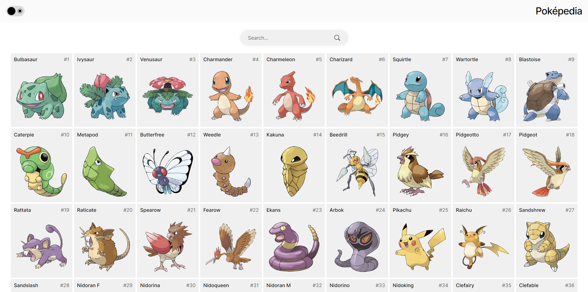
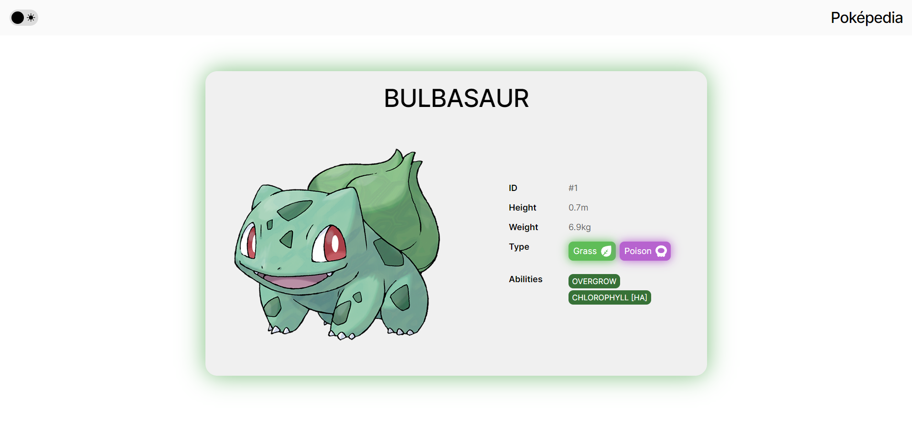
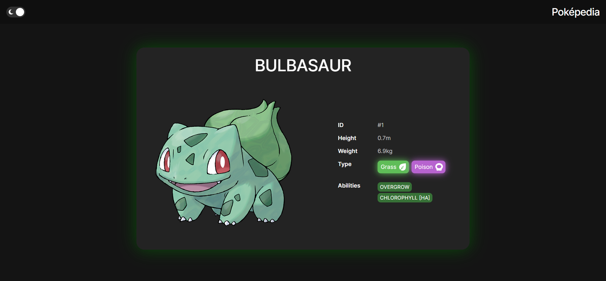
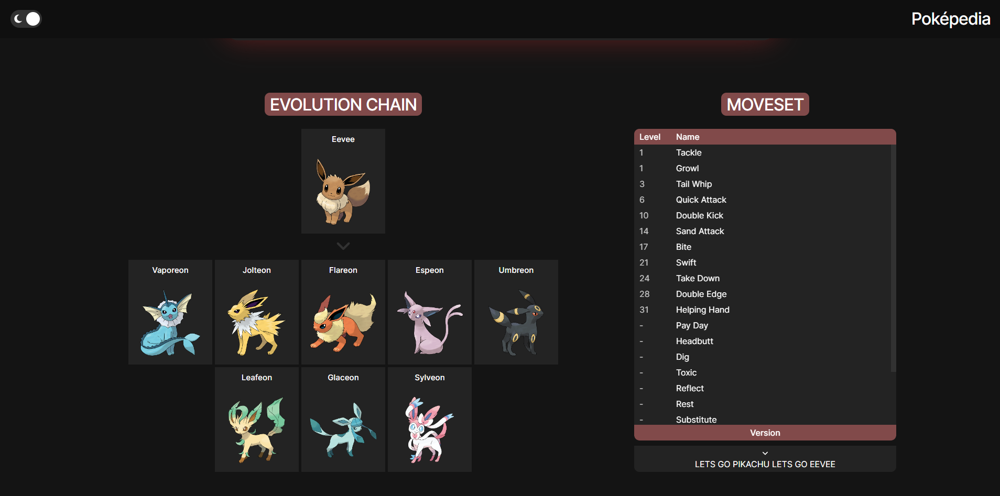

# [Poképedia](https://pokepedia.azurewebsites.net/)
A scalable recreation of the Pokédex from Pokémon games

## Description
All supported Pokémon entries are visible via the home page. A specific entry can be viewed by navigating to `/[id]`

## Getting Started

### Dependencies
- Git
- Node.js

### Installation & Execution
- Clone or download *this* repository
- Run `npm install` inside *this* folder
- Build and run the project with `npm run dev`

This app can also be installed by building a Docker image (`docker-compose build`)

## Acknowledgements
- [PokéAPI](https://github.com/PokeAPI/pokeapi) for providing real-time data
- [duiker101](https://github.com/duiker101/pokemon-type-svg-icons) for providing type icons

## Data which needs maintenance
- Pokémon types [corresponding images](static/assets/types) and [colors](src/lib/index.js). 

## Images

